# vocab app

## Basic Introduction
Vocab is a dictionary and word quiz application. It is built using Dart and Flutter framework. 
1. Project has **Clean Architecture** as proposed by Bob Martin (Author of Clean Code). 
2. **Test driven development** was followed when building the project.

# Features and Preview
## Feature 1: Searching word definitions
The following information is fetched from remote dictionaries:
1. Definition
2. Pronunciation 
    * Audio
    * Phonetic notiations
3. Examples
4. Thesaurus
    * Synonyms
    * Antonyms

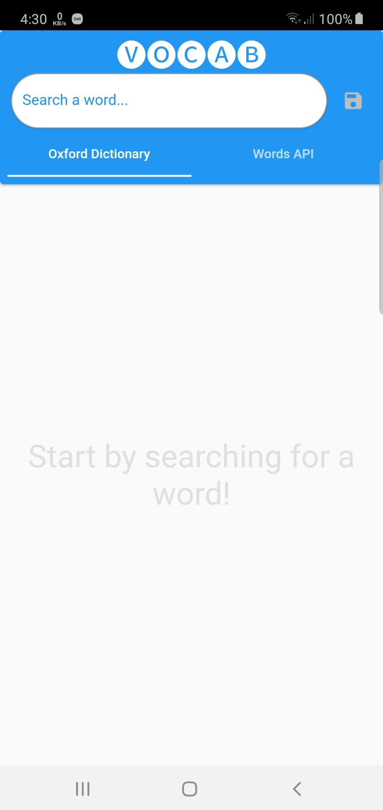
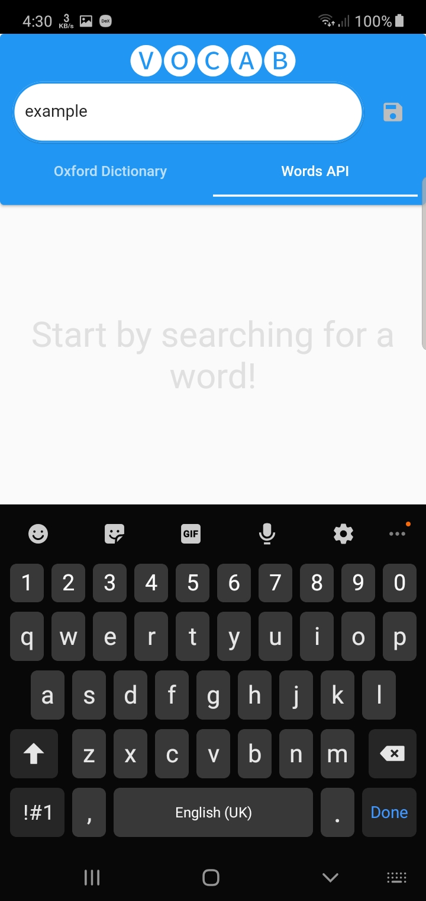
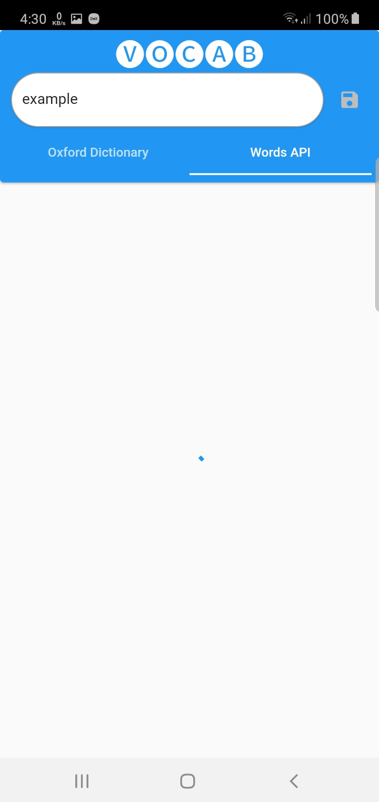
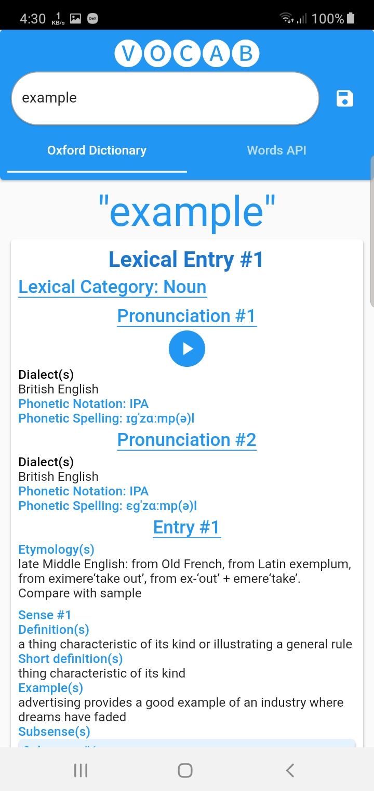
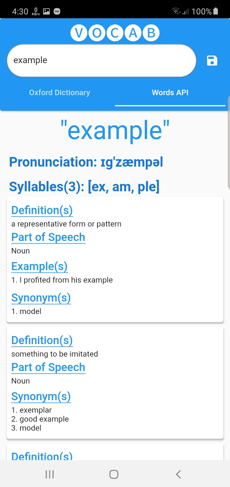

## Feature 2: Saving word definitions
Word information is saved to local SQLite database.

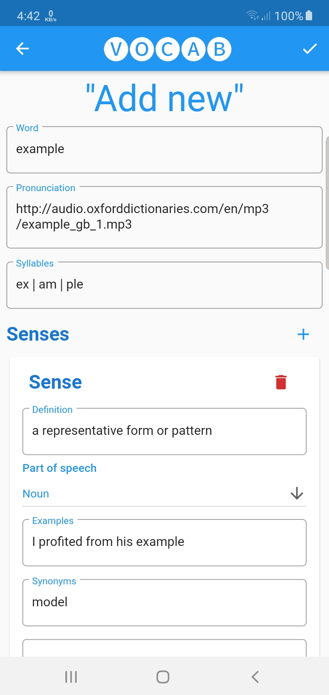
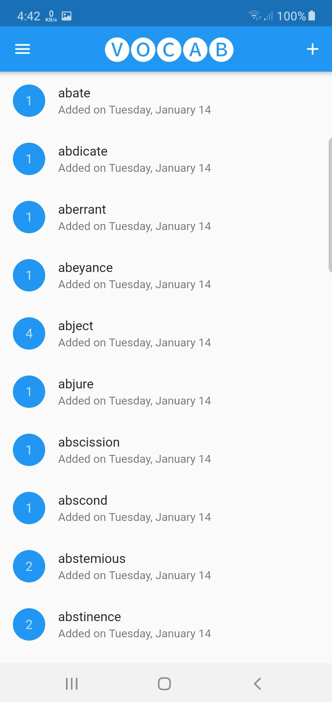
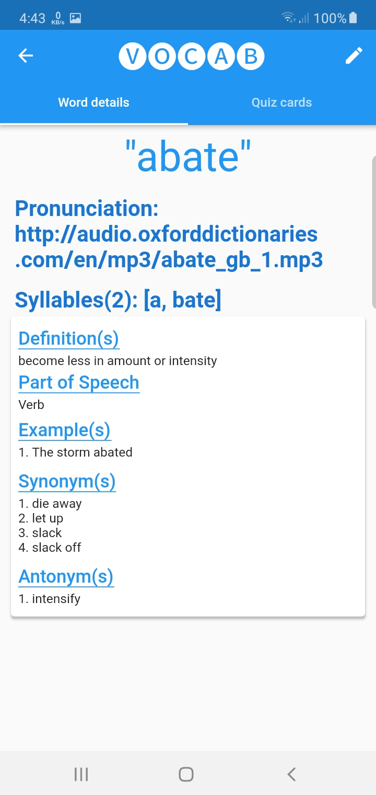

## Feature 3: Generating quiz cards and taking quizzes
Card information is generated automatically and saved to SQLite database.

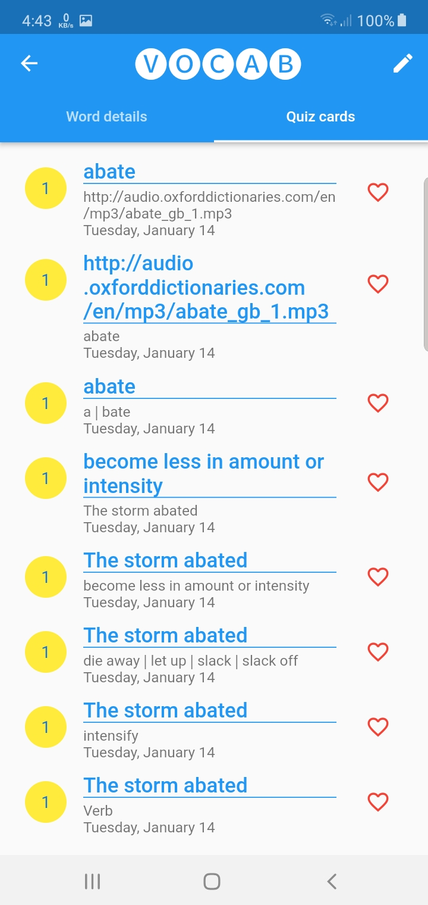
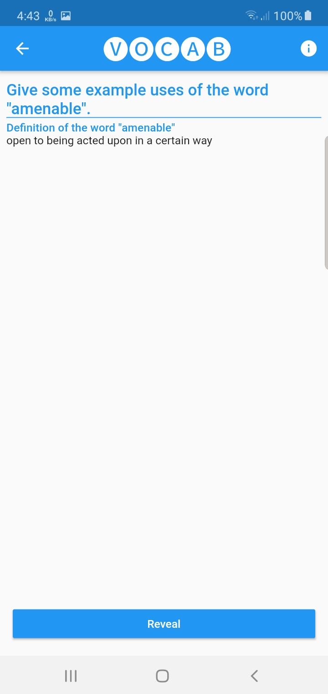
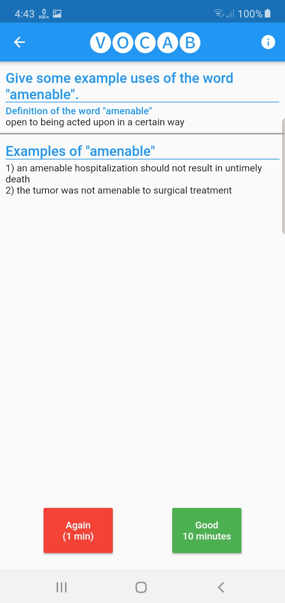

## Feature 4: Usage and quiz statistics graphs

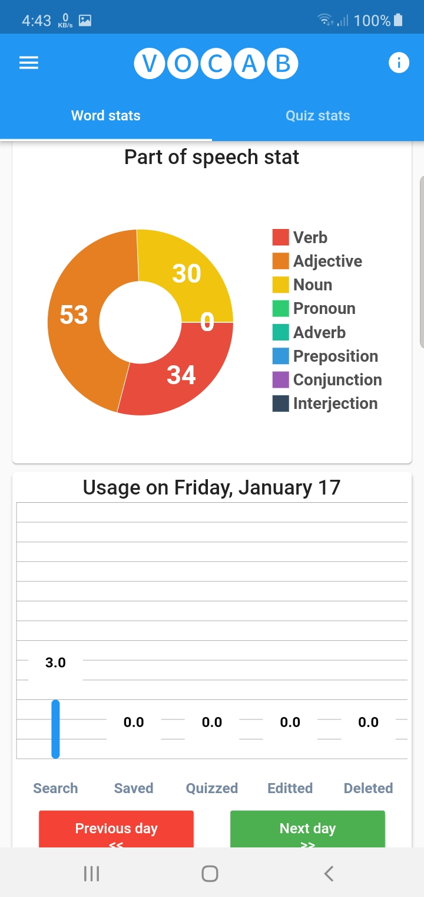
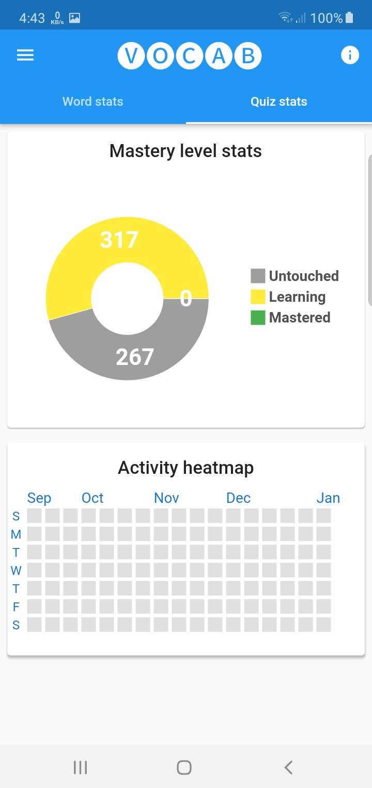

# Project Infomation

## Technologies used
1. Flutter framework
2. Dart programming language

### APIs used
Used RapidAPI services to integrate the API endpoints.
1. Oxford Dictionary Online
    * Entries API
2. Words API
    * Word API

## Database
Used SQL based database to store the word and quiz information.
* Library: [Moor for flutter](https://pub.dev/packages/moor_flutter)
* Testing: Not tested yet.

## State management
Handled using BLoC pattern.
* Library: [Flutter Bloc](https://pub.dev/packages/flutter_bloc)
* Testing: [Bloc test](https://pub.dev/packages/bloc_test)

## Charts and graphs
1. Bar and pie chart: [fl_chart](https://pub.dev/packages/fl_chart)
2. Activity heat map: [heatmap_calender](https://pub.dev/packages/heatmap_calendar)

## Miscellaneous
1. Dependency injection: [Get it](https://pub.dev/packages/get_it)
2. Comparison by value: [Equatable](https://pub.dev/packages/equatable)
3. Mock testing: [Mockito](https://pub.dev/packages/mockito)
4. Network status checking: [Data Connection checker](https://pub.dev/packages/data_connection_checker)

# Acknowledgements
1. Thanks to Oxford, Merrium Webstar, Words for their API services.
2. Thanks to all the amazing people who have developed the 3rd party libraries for flutter.
3. Thanks to the poeple who have developed the useful extensions for VS Code.
4. Special thanks to [Reso Coder](https://github.com/ResoCoder) for his amazing tutorials on flutter and dart.