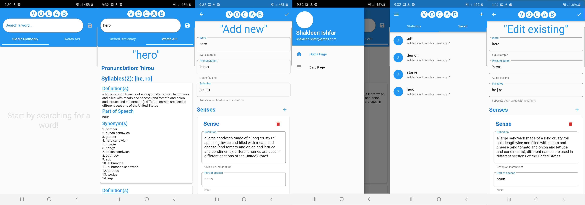

# vocab app

## Basic Introduction
Vocab is a dictionary and word quiz application. It is built using Dart and Flutter framework. 
1. Project has **Clean Architecture** as proposed by Bob Martin (Author of Clean Code). 
2. **Test driven development** was followed when building the project.

## Features
1. Look up word definitions from Oxford Dictionary.
    * Implemented using online dictionary APIs.
2. Save word definitions of searched words.
    * Uses SQL based database to store word details into local storage.
3. Allows the user to manually add word details.
4. Take quiz on saved words.
    * Implements spaced repetition studying.
    * Gamification. Rewards and penalty system implemented.
5. Back up progress and saved words.
    * Save to Google Drive. Sync between device and drive.

# Project Infomation

## Technologies used
1. Flutter framework
2. Dart programming language

## APIs Used
1. Oxford Dictionary Online
    * Entries API
2. Words API
    * Word API

## Database
Used SQL based database to store the word and quiz information.
* Library: [Moor for flutter](https://pub.dev/packages/moor_flutter)
* Testing: Not tested yet.

## State management
Handled using BLoC pattern.
* Library: [Flutter Bloc](https://pub.dev/packages/flutter_bloc)
* Testing: [Bloc test](https://pub.dev/packages/bloc_test)

## Miscellaneous
1. Dependency injection: [Get it](https://pub.dev/packages/get_it)
2. Comparison by value: [Equatable](https://pub.dev/packages/equatable)
3. Mock testing: [Mockito](https://pub.dev/packages/mockito)
4. Network status checking: [Data Connection checker](https://pub.dev/packages/data_connection_checker)

# Acknowledgements
1. Thanks to Oxford, Merrium Webstar, Words for their API services.
2. Thanks to all the amazing people who have developed the 3rd party libraries for flutter.
3. Thanks to the poeple who have developed the useful extensions for VS Code.
4. Special thanks to [Reso Coder](https://github.com/ResoCoder) for his amazing tutorials on flutter and dart. 