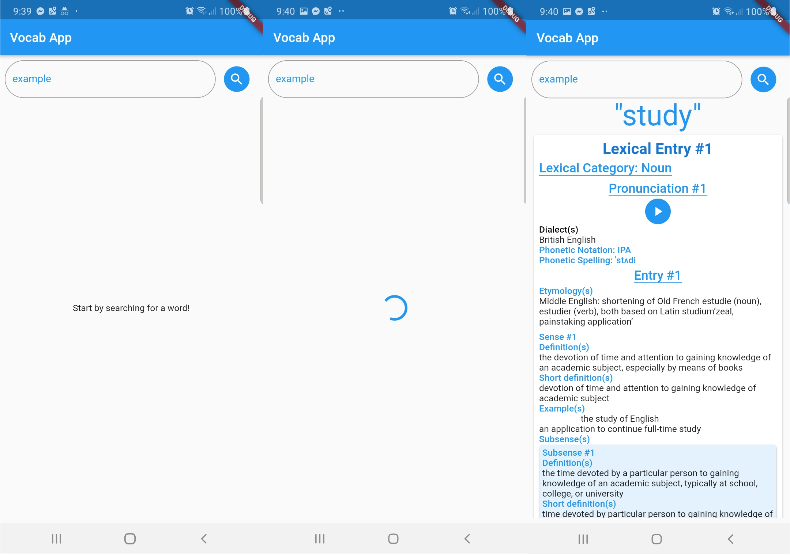

# vocab

A cross platform dictionary application build using Dart and Flutter. Uses Oxford and Merrium Webstar's Dictionary API to search for word definition and thesaurus. Also features the ability to save word information and take quizzes on saved words.

## Features
1. Look up word definitions from online dictionary.
2. Save word definitions and take quizzes on them.

# Developement infomation
1. Project has **Clean Architecture** as proposed by Bob Martin (Author of Clean Code). 
2. **Test driven development** was followed when building the project.
3. **BLoC Pattern** used for state management.

## Technologies used
1. Flutter framework
2. Dart programming language

## APIs Used
1. Oxford Dictionary API
    * Entries API
    * Lemmas API
2. Words API
3. Merrium Webstar API

## Testing process
1. Unit testing using mockito and bloc_test libraries.
2. Widget tests using the flutter widget tests functionality.
3. Integration tests using flutter driver.

## Libraries used
1. get_it
2. flutter_bloc
3. equatable
4. dartz
5. data_connection_checker
6. http
7. bloc_test
8. mockito

# Acknowledgements
1. Thanks to Oxford, Merrium Webstar, Words for their API services.
2. Thanks to all the amazing people who have developed the 3rd party libraries for flutter.
3. Thanks to the poeple who have developed the useful extensions for VS Code.